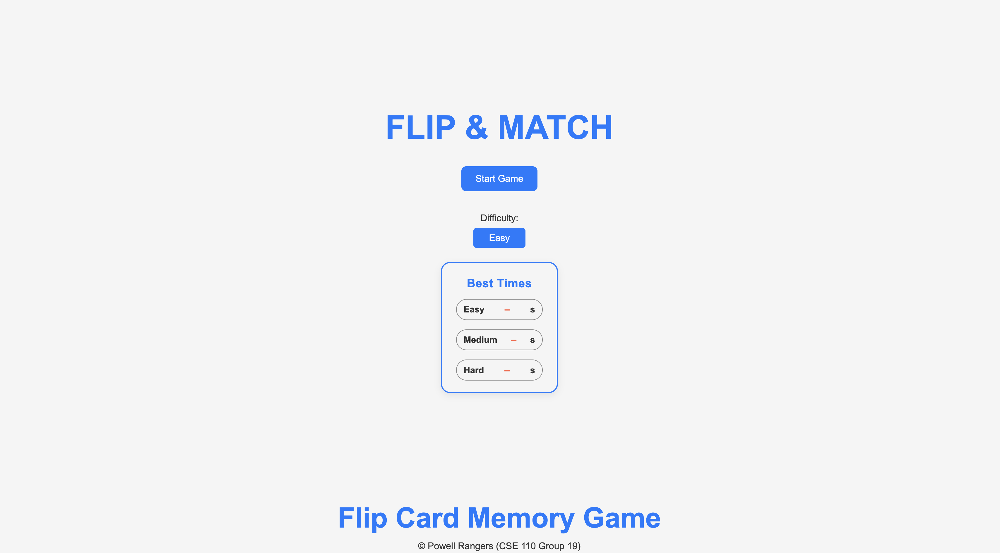
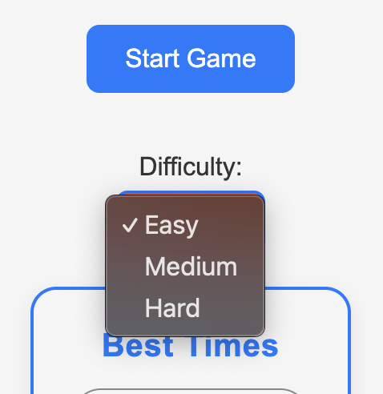

# Flip & Match

🕹️ Link to Project: [https://cse110-sp25-group19.github.io/cse110-sp25-group19/](https://cse110-sp25-group19.github.io/cse110-sp25-group19/)  
🎥 Link to Public Video: [https://www.youtube.com/watch?v=Y6LNI1QCWsE] (https://www.youtube.com/watch?v=Y6LNI1QCWsE)  
🎬 Link to Private Video: [https://www.youtube.com/watch?v=LP6G_2ZhnUI] (https://www.youtube.com/watch?v=LP6G_2ZhnUI)

## 🖼️ Preview

<!-- Replace with actual screenshot -->

## 🎮 How to Play

1. **Choose Difficulty**
   Use the dropdown menu to select a difficulty level.

   <!--  -->
   

2. **Click "Start"**  
   Begin the game by pressing the **Start** button.

3. **Start Matching Cards**
   Flip cards and try to match all pairs. Test your memory and beat your own time!
