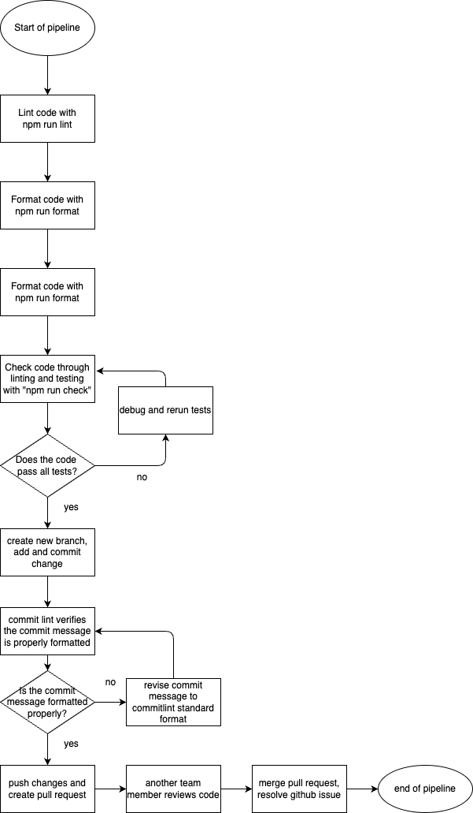

# Memory_Card_Game_CICD_Pipeline

This is a simple JavaScript and HTML project with a basic file structure, including automated code quality checks, pre-commit hooks, and conventional commit message enforcement.

## Developer Workflow

### Running the Project

To run the project locally:

1. Start the Development Server:
   ```bash
   npm start
   ```
   - Uses **`npx serve .`** to serve the project directory as a static site.
   - Opens **`index.html`** as the entry point.

### Code Quality Checks (Before Commit)

Developers should ensure their code is clean and properly formatted before committing:

1. Linting the Code:

   ```bash
   npm run lint
   ```

   - Runs **ESLint** on the **`src/`** directory to catch common JavaScript errors.

2. Formatting the Code:
   ```bash
   npm run format
   ```
   - Runs **Prettier** to automatically format code in the **`src/`** directory.

### Automated Code Quality Checks

- **Pre-Commit Hook:** Runs ESLint and Prettier automatically via **lint-staged**.
- **Commit Message Validation:** Enforces conventional commit messages via **commitlint**.
- **Pre-Push Hook:** Runs **`npm run check`** to validate code before pushing.

### Full Code Check Before Push

To run both linting and testing before pushing:

```bash
npm run check
```

- Runs both **`lint`** and **`test`** scripts to ensure code quality before pushing.

- **Start:** Open index.html in a browser.

### Running Tests

To run the unit tests:

```bash
npm test
```

- Runs all tests in the **`tests/`** directory using **Jest**.

To run the tests with code coverage:

```bash
npm run coverage
```

- Generates a coverage report for all tests.

---

### Pipeline checkpoint 2 additional notes:

- added automated tests via GitHub Actions

  - Linter/prettier test
  - Unit tests
  - Documentation

- Additional Notes:
  - pull requests (last step) are manual
  - pre-commit hook used so developers do not accidentally commit buggy/incorrectly formatted code

---

Diagram of the CI/CD pipeline (phase 1): <br />

