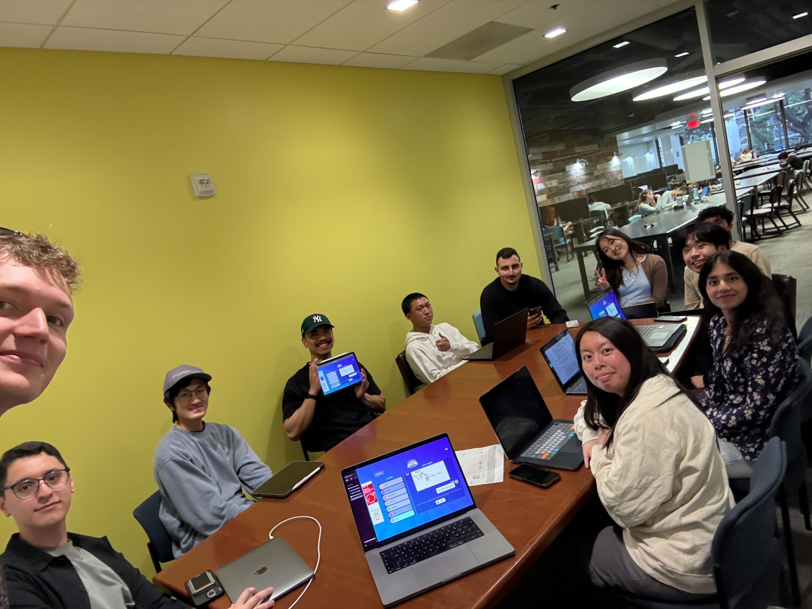

# 🚀 Team Powell Rangers

---
> *“Together, we are unstoppable. Just like the Power Rangers, our strength lies in working as one.”*  

Welcome to **Team Powell Rangers**! We’re a team of developers who value teamwork, communication, and always learning something new. Just like the Power Rangers, we believe that when we support each other and believe in ourselves, there’s no challenge we can’t tackle. Glad you’re here!

---

## 🎯 Our Values

- **Communication** – Good communication is key to working well together. It’s important to be respectful, honest, and clear so everyone feels heard and included.
- **Collaboration** – Getting things done is easier when everyone helps out. Whether it’s giving feedback, teaming up, or just checking in, working together makes the team stronger.
- **Learning** – There’s always something new to learn. Asking questions and sharing what’s learned helps everyone grow.
- **Inclusion** – Different ideas and backgrounds make the team better. Everyone should feel welcome and like they belong.
- **Fun** – Projects are more fun when everyone enjoys what they're doing.

---

## 💡 Team Leads

### Menko Hornstein
- **Introduction:** Hi, I’m Menko, a 21-year-old international student from Germany. I’m currently in my second year studying Business Informatics.
- **Fun Fact:** I ran my first marathon last year! 🏃‍♂️
- **GitHub:** [xveradus](https://xveradus.github.io/CSE-110/)

---

### Krystal Kwan
- **Introduction:** I'm Krystal and I'm a 3rd year (transfer) majoring in computer science from Muir College. Some hobbies I enjoy in my spare time are drawing and making stickers, playing Switch & mobile games, and making lattes ☕️
- **Fun Fact:** Even though I swore I'd never drink, I accidentally had half a mojito before realizing it contained alcohol. I didn’t know much about alcoholic drinks and (naively, in hindsight 😅) assumed mojitos were alcohol-free. The strange buzz I had after brought me to the realization that mojitos have alcohol.😭
- **GitHub:** [bellachip49](https://bellachip49.github.io/krystal-usr-page/)

## 👥 Team Members

###  Aditi Verma
- **Introduction:** Lorem ipsum dolor sit amet, consectetur adipiscing elit, sed do eiusmod tempor incididunt ut labore et dolore magna aliqua.
- **Fun Fact:** Lorem ipsum dolor sit amet, consectetur adipiscing elit, sed do eiusmod tempor incididunt ut labore et dolore magna aliqua.
- **GitHub:** [aditi-3](https://aditi-3.github.io/GitHub-Pages-project/)

---

###  Chris Park

- **Introduction:** Lorem ipsum dolor sit amet, consectetur adipiscing elit, sed do eiusmod tempor incididunt ut labore et dolore magna aliqua.
- **Fun Fact:** Lorem ipsum dolor sit amet, consectetur adipiscing elit, sed do eiusmod tempor incididunt ut labore et dolore magna aliqua.
- **GitHub:** [qwer030413](https://qwer030413.github.io/CSE110Review/)

---
###  Derek Wu

- **Introduction:** 
name: derek wu 
year + major: 3rd year math-cs
- **Fun Fact:** I prefer cats over dogs. 🐈
- **GitHub:** [derekwu009](https://derekwu009.github.io/github-pages/#my-user-page)

---
###  John De Castro

- **Introduction:** My name's John De Castro. I’m a 3rd year transfer majoring in Computer Science. For fun I love to travel, hike, exercise, and spend time with my dog. 🐶
- **Fun Fact:** A fun fact about me is that I have visited 12 countries! 🌍
- **GitHub:** [johndecastro](https://johndecastro.github.io/Github-User-Page/)

---
###  Lavin Ma

- **Introduction:** Hi, I’m Lavin and I’m a Math-CS major at UCSD! In my free time, I enjoy tanning and swimming at the beach, going on walks, and watching Youtube. School-wise, I’m interested in machine learning and data visualization. I am really excited to create a project in this class and am looking forward to learning more about CS in industry! 💻
- **Fun Fact:** I collect shells everytime I go to the beach! 🐚
- **GitHub:** [lavinma](https://lavinma.github.io/)

---
### Mohammed Azab

- **Introduction:** Hi guys! I’m a Math-CS junior at Muir. Excited to work with you all this quarter :)
- **Fun Fact:** I’m planning on getting my private pilot license soon!
- **GitHub:** [mazab2003](https://mazab2003.github.io/mazabCse110/##about-me)

---
### Nathan Nguyen

- **Introduction:** Hey there, I’m Nathan Nguyen, and I’m a third-year transfer student pursuing a degree in Computer Science. My goal is to start out as a software engineer and eventually transition into a role in cybersecurity. I primarily work with Python and C/C++ in my projects, but I’m always eager to explore new languages and technologies. 
- **Fun Fact:** Outside of coding, you can find me cooking, gaming, or cuddling with my adorable cat. 🐱
- **GitHub:** [nathannewwin](https://nathannewwin.github.io/CSE110Project/)

---
### Rohan Madan

- **Introduction:** Lorem ipsum dolor sit amet, consectetur adipiscing elit, sed do eiusmod tempor incididunt ut labore et dolore magna aliqua.
- **Fun Fact:** Lorem ipsum dolor sit amet, consectetur adipiscing elit, sed do eiusmod tempor incididunt ut labore et dolore magna aliqua.
- **GitHub:** [rohanmad](https://rohanmad.github.io/cse110lab1/)

---
### Sarkis Bagdasaryan

- **Introduction:** Hello! My name is Sarkis Bagdasaryan, and I am a second year Computer Science major in Sixth College. I'm from Van Nuys, California. I have limited experience with programming and software engineering outside of my past coursework at UCSD, but am excited and eager to collaborate with my team and get started working towards developing our project!
- **Fun Fact:**  Some of my hobbies are fishing, golfing, playing basketball, and video games 🎮
- **GitHub:** [sakobagz](https://sakobagz.github.io/Pages/)

---
> *"It's ~~Morphin~~ Codin Time!"* – Team Powell Rangers
